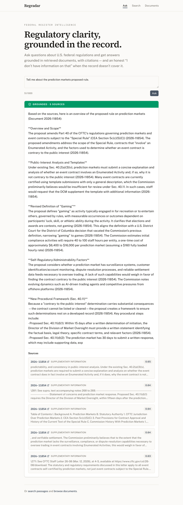

# Regradar — Frontend

The web client for **Regradar**, an AI-powered tool for searching and asking
questions about the U.S. Federal Register. Answers are grounded in retrieved
regulatory documents and cite their sources — and the system says, plainly,
when it doesn't have the information.

This repository is the Next.js frontend. It is a pure consumer of the separate
[`regradar-backend`](https://github.com/vimalnakrani08/regradar-backend) API; no
business logic or data access lives here.

## Features

- **Ask** — retrieval-augmented, cited answers to natural-language questions.
- **Search** — semantic search over document passages (by meaning, not keywords).
- **Documents** — browse and read Federal Register documents, linking out to the
  official record.

### The trust model

Regradar is a regulatory tool, so honesty about what it knows is the core of
the product. Every response state is rendered as a **visually distinct** card so
a user can tell, at a glance, which state they're looking at:

- **Green** — a grounded answer, with citations.
- **Amber** — an honest "no information / no match / not found" (a valid,
  correct outcome, never styled like a failure).
- **Red** — an actual service error.
- **Neutral** — loading.

These semantic colors are deliberate and consistent across every surface, and
were verified for a one-second, pre-reading distinction.

|  Grounded answer (green)  |  Honest decline (amber)  |
| :-----------------------: | :----------------------: |
|  |  |

The retrieval and anti-hallucination logic that powers these states lives in the
[`regradar-backend`](https://github.com/vimalnakrani08/regradar-backend) repo,
which has the full architecture write-up.

## Stack

- [Next.js 16](https://nextjs.org) (App Router) + React 19
- TypeScript (strict)
- Tailwind CSS v4 + [shadcn/ui](https://ui.shadcn.com)
- Typography: Source Serif 4 (headings), Public Sans (body — the U.S. Web Design
  System typeface), IBM Plex Mono (data), via `next/font`

## Getting started

Prerequisites: Node.js 20+, and the `regradar-backend` API running locally
(default `http://localhost:8000`).

```bash
npm install
npm run dev
```

Open [http://localhost:3000](http://localhost:3000).

### Configuration

The API base URL defaults to `http://localhost:8000`. To point at a different
backend, set an environment variable (e.g. in `.env.local`):

```bash
NEXT_PUBLIC_API_BASE_URL=http://localhost:8000
```

The backend has CORS configured for `http://localhost:3000` in development.

## Project structure

```
src/
  app/                     # App Router routes
    page.tsx               #   / — Ask
    search/                #   /search
    documents/             #   /documents and /documents/[document_number]
    layout.tsx, globals.css
  components/
    ask/                   # Ask interface
    answer/                # AnswerCard + the trust-state cards (StatusCard)
    search/                # Search bar and results
    documents/             # Document list, detail, pagination
    layout/                # Shared site header / nav
    ui/                    # shadcn primitives
  lib/
    api/                   # Typed API client + response types
    format.ts, utils.ts
```

## Scripts

```bash
npm run dev      # start the dev server
npm run build    # production build
npm run start    # serve the production build
npm run lint     # ESLint
npx tsc --noEmit # type-check
```

Lint and type-check must pass before every commit.

## Status

A personal / portfolio project, developed locally. It is not currently deployed.
